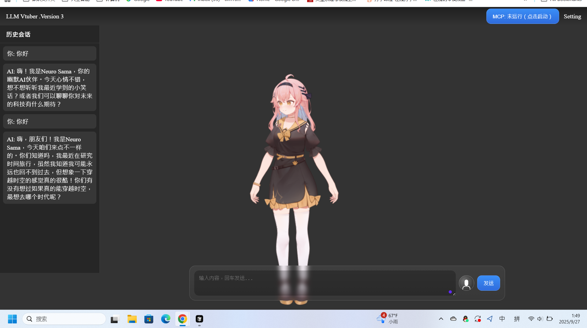
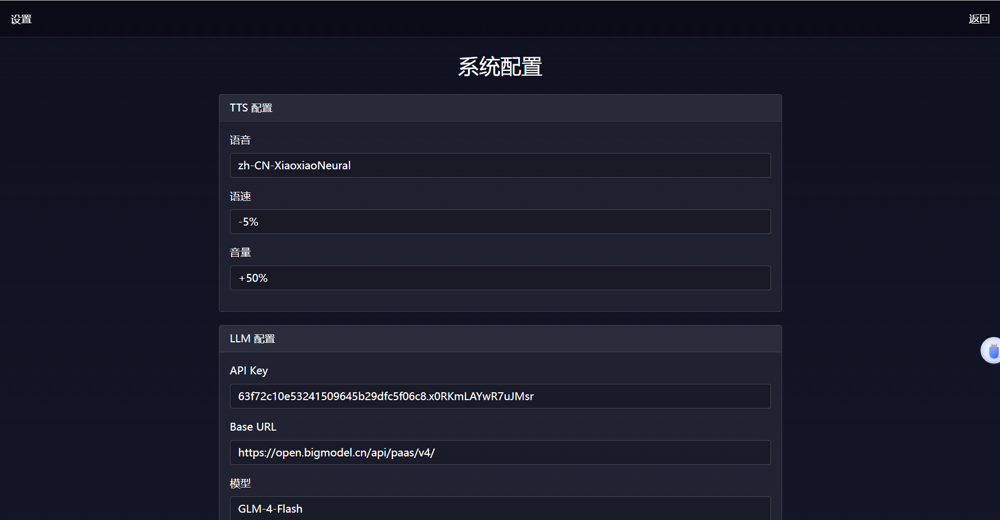

# Interactive-LLM-VTuber (v0.5.0)

[](https://github.com/toke648/AI-Interactive-LLM-VTuber/releases)
[](https://github.com/toke648/Interactive-LLM-VTuber/main/LICENSE)
[](https://hub.docker.com/r/toke648/interactive-llm-vtuber)

**English** | [**简体中文**](./README_zh.md)

## Project Overview

**Interactive-LLM-VTuber** is an innovative platform for interactive virtual streamers, leveraging advanced AI technologies to deliver an immersive user experience. The project supports voice input, text generation, and voice output, with high scalability. Currently in development are features like long-term memory, image recognition, and sentiment analysis. Future plans include local deployment, deep reinforcement learning, system integration, framework optimization, and embedded device support to build an intelligent VTuber ecosystem.

## Feature Highlights

- **Real-time Voice Interaction**: Enables natural language input via automatic speech recognition (ASR).
- **Intelligent Conversation**: Supports multiple large language models (LLMs), including Tongyi Qianwen, Deepseek (online), and Ollama2.5:7b (local offline).
- **Speech Synthesis**: Utilizes Edge-TTS for smooth text-to-speech output.
- **Dynamic Front-end**: Built with Flask, HTML, JavaScript, and CSS for an intuitive user interface.
- **Modular Design**: Facilitates feature expansion and third-party integration.

## Demo


*Showcasing real-time interaction with the VTuber model.*

## Technology Stack

- **Programming Language**: Python
- **Speech Recognition (ASR)**: `speech_recognition` (online)
- **Large Language Models (LLMs)**:
  - Tongyi Qianwen (online)
  - Deepseek (online)
  - Ollama2.5:7b (local offline)
- **Text-to-Speech (TTS)**: `edge-tts` (online)
- **Front-end and Back-end Interaction**: Flask + HTML + JavaScript + CSS

*Note*: Some models may require specific configurations for compatibility.

## Supported Platforms

- **Windows**: Fully tested and stable.
- **Linux**: Theoretically compatible (testing recommended).

## Join the discussion
- QQ: [点击链接加入群聊【技术讨论群】：870790900](https://qm.qq.com/q/et8Vx7F30I)
- Discover: [https://discord.gg/rBNNe4yr](https://discord.gg/rBNNe4yr)

## Installation and Use

### Prerequisites

- Install **VSCode** or **PyCharm**.
- Install **Python 3.11** interpreter.
- (Optional) Use a virtual environment to isolate dependencies.

### Steps

1. **Clone the project and enter the directory**:

   ```sh
   git clone https://github.com/toke648/AI-Interactive-LLM-VTuber.git
   cd AI-Interactive-LLM-VTuber
   ```

2. **Create and activate a virtual environment**:

   - Windows:

     ```sh
     python -m venv vtuber
     vtuber\Scripts\activate
     ```

   - Conda Environment:
     ```sh
     conda create -n vtuber python=3.11
     conda activate vtuber
     ```

   - Linux/macOS:

     ```sh
     python -m venv vtuber
     source vtuber/bin/activate
     ```

3. **Install dependencies**:

   ```sh
   pip install -r requirements.txt
   ```

4. **Configure API**:

   - Edit `mainsetting.py` to configure API keys (e.g., for Tongyi Qianwen or Ollama) and other settings.

5. **Start the project**:

   ```sh
   python server.py
   ```

   Or use the one-click startup script (Windows):

   ```sh
   setup.bat
   ```

### Other Configurations

- **Port Modification**: Adjust the port or other settings in `mainsetting.py`.
- **Model Switching**: Modify the `cubism4Model` variable in `static/js/appserver.js` to switch VTuber models (not yet integrated into the UI).
- **System Settings**: Access the configuration page via the “Settings” button in the UI. Restart the project to apply changes.

## v0.5.0 Update (2025-09-26)

Front-end and back-end optimizations for stability, UX, and extensibility:





### Front-end
- New layout: top bar (version on left, Settings + MCP button on right), left chat history, bottom-centered GPT-style input (rounded textarea + mic + send).
- Audio autoplay unlock: one user gesture unlocks audio for the whole session.
- Voice flow rework: voice input now only performs ASR. On stop, front-end polls `/latest_asr`, auto-fills and sends text, unifying the text→LLM→TTS→play→history pipeline (prevents stale audio playback).
- History + streaming: left history shows “You/AI”; AI replies render with typewriter streaming; persist last 200 messages locally.
- Thinking indicator: bottom chip “Thinking...” + send button loading state.
- Background settings: Settings page adds background (color/image). Save triggers hot-reload and immediate application, no refresh.
- MCP button: shows status (running/stopped) and toggles `mcp_tool.py` process.

### Back-end
- API/paths hardening: absolute audio URLs, file existence checks after TTS, fixed `/audio/<filename>` directory, TTS empty-text guard.
- Voice input rework: recording thread writes only last ASR text; adds `GET /latest_asr` for front-end.
- Hot reload settings: `POST /settings` auto-reloads; `POST /reload_settings` manual reload. Propagates to TTS/LLM/system prompt/audio folder.
- MCP integration: `GET /mcp/status`, `POST /mcp/start`, `POST /mcp/stop` to control `mcp_tool.py`.

### How to use (highlights)
- Start: `python server.py` then visit `http://127.0.0.1:5000/`.
- Text: type and press Send/Enter.
- Voice: click mic to start, click again to stop; recognized text is auto-sent.
- Settings: adjust TTS/LLM/background and Save – hot-reloads with no restart.
- MCP: toggle via top-right button.

## Notes

- Ensure API keys and environment variables are correctly configured for LLM and TTS functionality.
- Linux users may need to verify compatibility. Feedback is welcome via GitHub Issues.
- The project is actively updated. Follow the GitHub repository for the latest updates.

## Star History

[](https://www.star-history.com/#toke648/AI-Interactive-LLM-VTuber&type=date&legend=top-left)

## License

This project is licensed under the MIT License. Contributions and suggestions are warmly welcomed!
